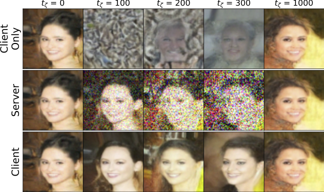

# CollaFuse: Distributed Collaborative Diffusion Models for Synthetic Image Generation



## Abstract

In the landscape of generative artificial intelligence, diffusion-based models have emerged as a promising method for generating synthetic images. However, the application of diffusion models poses numerous challenges, particularly concerning data availability, computational requirements, and privacy. Traditional approaches to address these shortcomings, like federated learning, often impose significant computational burdens on individual clients, especially those with constrained resources. In response to these challenges, we introduce a novel approach for distributed collaborative diffusion models inspired by split learning. Our approach facilitates collaborative training of diffusion models while alleviating client computational burdens during image synthesis. This reduced computational burden is achieved by retaining data and computationally inexpensive processes locally at each client while outsourcing the computationally expensive processes to shared, more efficient server resources. Through experiments on the common CelebA dataset, our approach demonstrates enhanced privacy by reducing the necessity for sharing raw data. These capabilities hold significant potential across various application areas, including the design of edge computing solutions. Thus, our work advances distributed machine learning by contributing to the evolution of collaborative diffusion models.

## Getting Started

### Prerequisites

- Python 3.10 or newer
- Virtual environment tool (e.g., venv, virtualenv)

### Setup

1. Clone the repository to your local machine:

   ```bash
   git clone https://github.com/SimeonAllmendinger/collafuse.git
   cd collafuse
   ```

2. Create a virtual environment and activate it:

   ```bash
   python3 -m venv .venv
   source .venv/bin/activate
   ```

3. Install the required dependencies:

   ```bash
   pip install -r requirements.txt
   ```

### Data Preparation

Download the [CelebA](https://www.kaggle.com/datasets/jessicali9530/celeba-dataset/download?datasetVersionNumber=2) dataset and save it in your data directory `<data_dir>`. The dataset can be obtained from the official source. Please ensure you comply with the dataset's usage policy.

### Running the Model

Prior to start collaborative training, adjust the `results_folder` in `./configs/config_diffusion_trainer`. Now, you can use the following command, replacing `<data_dir>` with the path to your data directory:

```bash
.venv/bin/python3 ./src/components/main.py --path_tmp_dir <data_dir>
```

### Configuration

- To switch between training and testing modes, modify the settings in `./configs/config_diffusion_trainer`.

- Individual clients can adjust the cut point and select the dataset by editing `./configs/config_clients` and `./configs/config_clouds`.

## License

This project is licensed under the MIT License - see the LICENSE file for details.

## BibTeX Citation

If you use CollaFuse, we would appreciate using the following citation:

```
@misc{zipperling2024collafuse,
      title={CollaFuse: Navigating Limited Resources and Privacy in Collaborative Generative AI}, 
      author={Domenique Zipperling and Simeon Allmendinger and Lukas Struppek and Niklas Kühl},
      year={2024},
      eprint={2402.19105},
      archivePrefix={arXiv},
      primaryClass={cs.LG}
}
```
